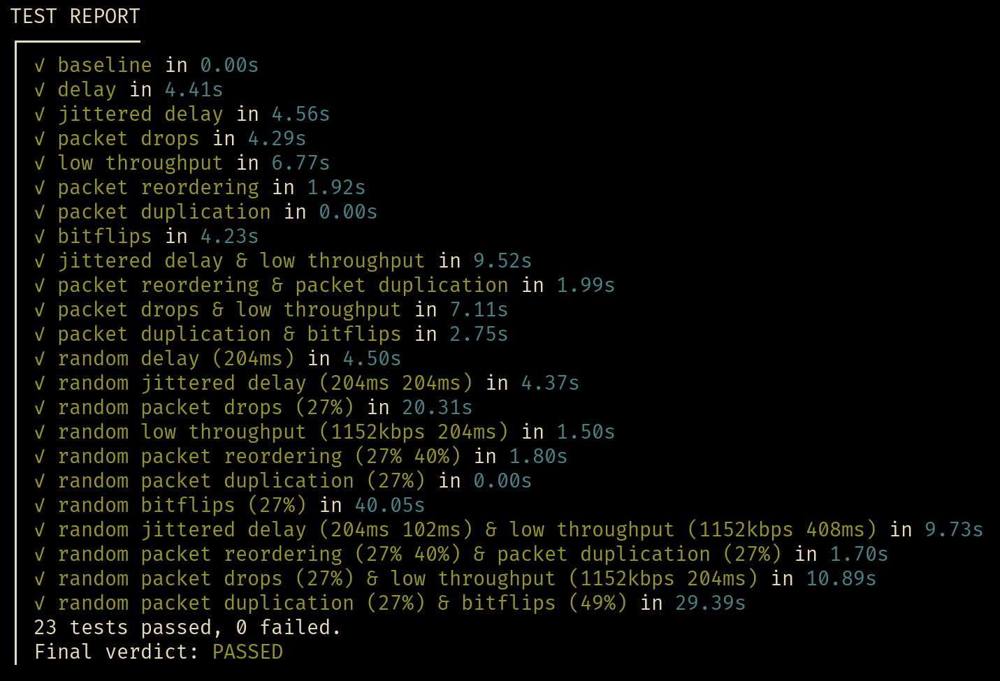

# Assignment 3 - Model Based Testing
## Installation
1. Install TorXakis, Python and pip
2. Install Python-Quickcheck by running `pip install python-quickcheck`

## TorXakis usage
1. Run TorXakis with the TCP definition: `torxakis.exe .\torxakis\TCP.txs`
2. Start the SUT in another terminal: `python .\src\socketcomms.py 7890`
3. In the TorXakis REPL, run the following commands:
   - `param_Sut_deltaTime 10000000`
   - `tester TCP Sut`
   - `test 100` (or however many tests you want to run)

## Pytest-Quickcheck usage
To run the tests, run `py.test -v .\quickcheck\run_tests.py`. If you want to see
the progress within a test, add `--capture=tee-sys` to the end of that command.

# Assignment 2 - Automatic test tool
This test tool automatically runs all tests defined in [`src/tests.py`](src/tests.py).
It gathers the information about test pass/fail status and how long each test
took, and displays it in a summary.
The test cases also contain randomised tests, where the arguments to the network
tampering vary between a some lower and upper bound. They change every time the
tests are run.

Note that for some tests the number of messages sent is reduced from 100 to 10.
This is done for those tests that take a much longer time, i.e. with delay or
packet drops.

## Usage
Important: the tests only work on Linux, because they make use of the `tc` command.
1. **Clone this repository.**  
    `git clone git@github.com:Dantevg/TestingTechniques.git`
2. **Run the tests.** Make sure nothing else is using the localhost network.
    Sudo is required for the network tampering. The test runner expects one
    argument, the network interface to tamper with (usually `lo`, loopback).  
    `sudo python3 ./run_tests.py lo`
3. **Wait for test results.**
4. ???
5. **Profit!**
    
